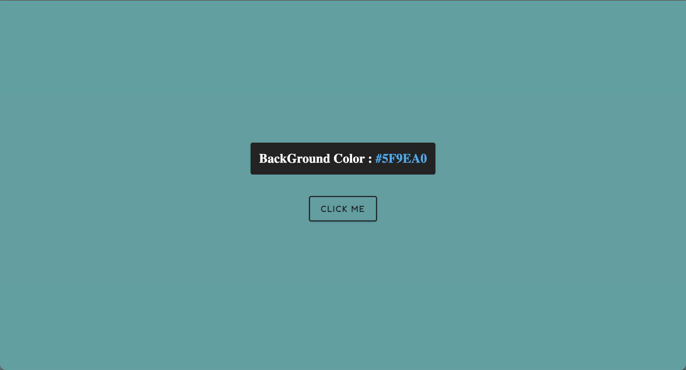
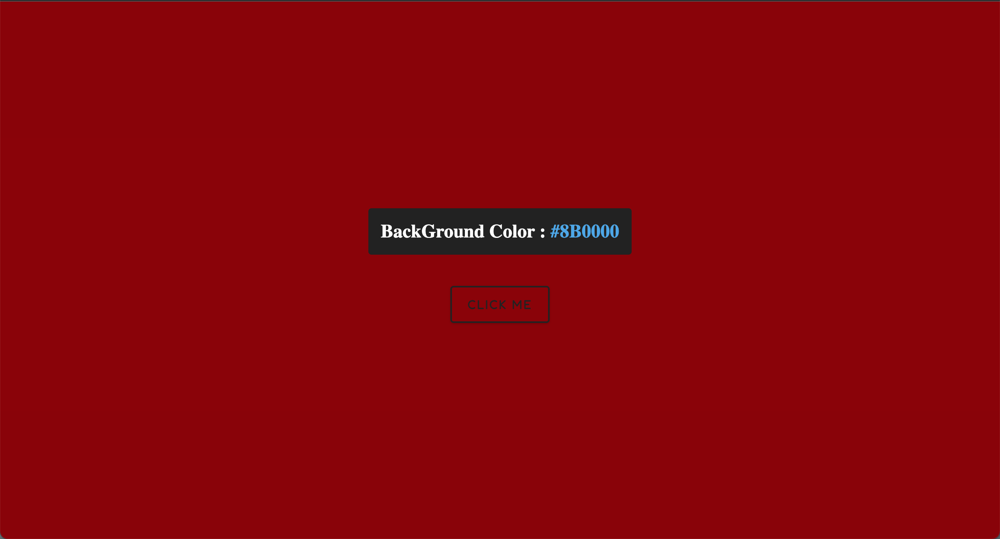

# 
## Starting 🚀

- Open VS Code.
- Clone Git Repository.
- Paste https://github.com/domofra/Proyecto-04-Individual-JS
- Enjoy.

See **Installation** to learn how to deploy the project.

### Requeriments 📋

- VS Code.
- Browser.

### Installation 🔧

- Git clone https://github.com/domofra/Proyecto-04-Individual-JS
- Open index.html.
- Enjoy.

### Coding style tests ⌨️

Verifies the proper functioning of the web with the technologies applied to it.

## Made with 🛠️

* [HTML & CSS] - HTML for the creation of the web page and CSS to style it.
* [JAVASCRIPT] - To give animations to the web.
* [VISUAL STUDIO CODE] - (https://code.visualstudio.com/)
* [GIT & GITHUB] - Keeping track of changes in computer files including coordinating team work.

## Versions 📌

For all available versions, see the [tags in this repository](https://github.com/domofra/Proyecto-04-Individual-JS).

## Autor ✒️

domofra

---
